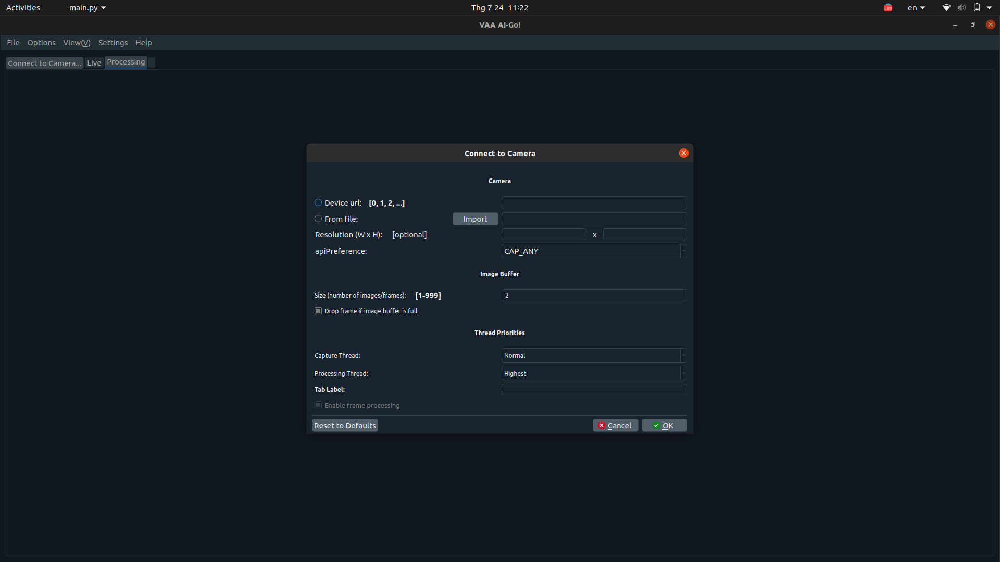
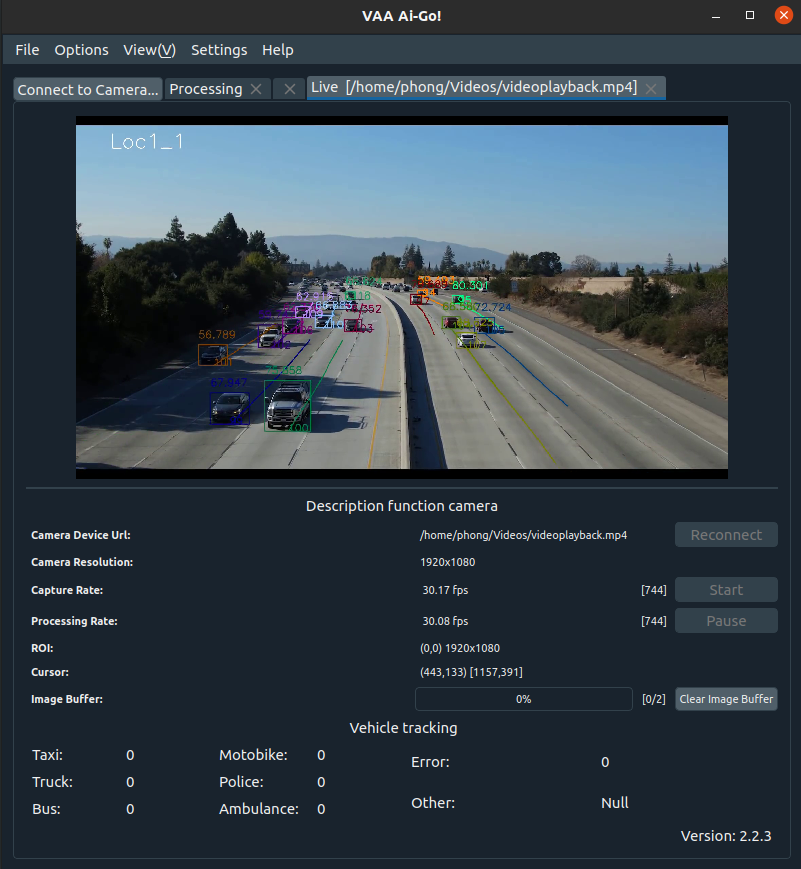

  

<h1 align="center">VAA Ai Go!</h1>
<h3 align="center">Application vehicle speed estimation and error detection using Deep Learning - Internet Of Things</h3>

  

 

### About the project
The purpose of this project is to create a software system to monitor the speed of vehicles on the road and detect cases exceeding the speed limit, impose penalties according to the laws of the host country, help improve security. safe and minimize traffic accidents with the use of deep learning models in the system.

This project has been built using the [PyQt5](https://www.qt.io/design?utm_campaign=Navigation%202019&utm_source=Nav%202019) framework, which allows to build an app for mobile, desktop & web from a single codebase.

  

## Features

## Download & install

## Built with
- [PyQt5](https://flutter.dev/) - Beautiful native apps in record time.
- [OpenCV](https://developer.android.com/studio/index.html/) - Tools for building apps on every type of Android device.
- [Visual Studio Code](https://code.visualstudio.com/) - Code editing. Redefined.
- [Yolov3](https://code.visualstudio.com/) - Code editing. Redefined.
- [Tensorflow](https://code.visualstudio.com/) - Code editing. Redefined

## Authors
- ** Phong .Pham Thanh ** - Software Engineer:[Github]{},[Twitter]{},[Linkdln]{},[Viber]{}
- ** Phuoc .Ha Quang ** - Ai Engineer: [Facebook]{}.[Viber]{}
- ** Tuan .Nguyen Van Anh ** - Inter Supporter: [Github]{}, [Facebook]{}

## Contributing

## License
This project is licensed under the GNU GPL v3 License - see the [LICENSE.md](LICENSE.md) file for details.